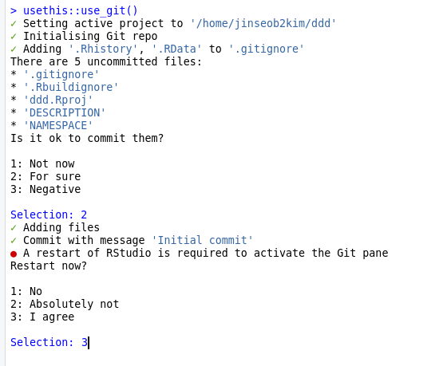
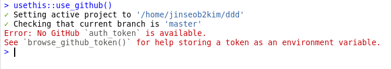
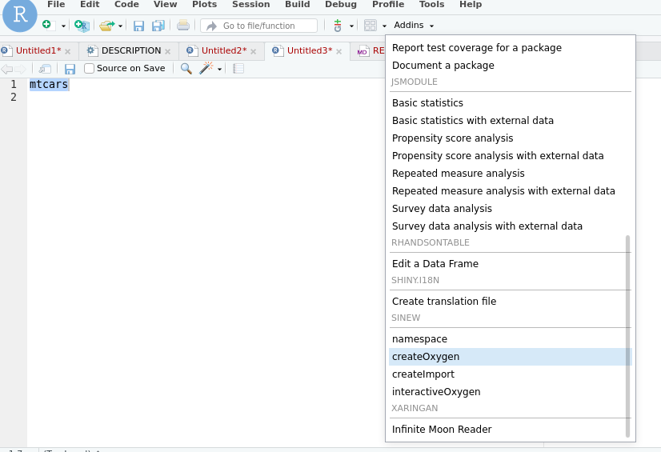

# RTHON2020

<!-- badges: start -->
<!-- badges: end -->


## R 패키지 프로젝트 만들기

```r
usethis::create_package("PATH/package_name")

## example: package name - RTHON2020
usethis::create_package("~/Lecture/RTHON2020")
```

해당 프로젝트로 RStudio 가 재시작된다. 

## R에서 깃헙 Repository 만들기

먼저 git 을 활성화한다.

```r
usethis::use_git()
```



위 그림처럼 RStudio 를 재시작하자. 이제 깃헙 Repository 를 만들고, 여기에 파일들을 올리자. 먼저 아래 명령어를 실행한다.

```r
usethis::use_github()
```




깃헙토큰이 없다는 메시지가 뜰 것이다. 메시지 내용대로 `browse_github_token()` 를 실행해서 깃헙 토큰을 등록하고 그 번호를 기억하자.

```r
usethis::browse_github_token()
```

깃헙 홈페이지 새창이 뜨고 비밀번호를 입력하면, Token 만드는 화면으로 이동한다. 적당한 이름으로 토큰 만든 후 아래 generate token 버튼을 누르면 토큰번호가 보이는데, 이것을 복사해놓자.


이제 이 토큰번호를 R 환경변수로 넣어야 한다. `edit_r_environ()` 로 **.Renviron** 을 연 후 아래처럼 입력한 후 저장하자(xxxyyyzzz 대신 토큰번호).

```sh
## .Renviron
GITHUB_PAT=xxxyyyzzz
```

이제 다시 `usethis::use_github()` 를 실행하면 Repository 가 만들어진다. 본인 깃헙 계정에서 만들어진 것을 확인하자.


## 데이터 저장하기

저장하고 싶은 데이터를 **R object** 로 저장한 후 `use_data()` 를 이용하자. 아래는 기본데이터 **mtcars** 의 예시이다.

```r
usethis::use_data(mtcars)
```

**data** 폴더가 만들어지고 **mtcars.rda** 파일이 만들어진 것을 볼 수 있다.


## 데이터 설명문서 작성 

먼저 R 폴더를 만든 후 아무이름으로 빈 R 파일을 만들자. [sinew](https://github.com/yonicd/sinew) 패키지 설치 후 RStudio 재시작하면 **Addins** 에 `createOxygen` 버튼이 추가되는데, R 파일에 저장된 데이터이름을 *드래그* 한 후 이 버튼을 누르자.




```r
#' @title DATASET_TITLE
#' @description DATASET_DESCRIPTION
#' @format A data frame with 32 rows and 11 variables:
#' \describe{
#'   \item{\code{mpg}}{double COLUMN_DESCRIPTION}
#'   \item{\code{cyl}}{double COLUMN_DESCRIPTION}
#'   \item{\code{disp}}{double COLUMN_DESCRIPTION}
#'   \item{\code{hp}}{double COLUMN_DESCRIPTION}
#'   \item{\code{drat}}{double COLUMN_DESCRIPTION}
#'   \item{\code{wt}}{double COLUMN_DESCRIPTION}
#'   \item{\code{qsec}}{double COLUMN_DESCRIPTION}
#'   \item{\code{vs}}{double COLUMN_DESCRIPTION}
#'   \item{\code{am}}{double COLUMN_DESCRIPTION}
#'   \item{\code{gear}}{double COLUMN_DESCRIPTION}
#'   \item{\code{carb}}{double COLUMN_DESCRIPTION} 
#'}
#' @details DETAILS
"mtcars"
```

위 내용이 **R 패키지 문서**로 포함되니 데이터 설명에 맞도록 수정하자.


## 패키지 빌드

패키지가 제대로 만들어졌는지 확인한다. Build 탭의 check 버튼을 누르면 되고, man 폴더에 문서 파일이 저장되는 것을 볼 수 있다. 결과에 *error* 가 없으면 제대로 된 것이다. **CRAN** 에 올리려면 warning과 note도 없어야 함을 기억하자.


## 깃헙에 올리기

마지막으로 Git 탭에서 commit, push 를 수행하면 패키지가 업데이트된다. `remote::install_github()` 으로 패키지를 설치하면 데이터를 불러올 수 있다.


## 멘티 결과물 

### 크로폴 팀 

https://github.com/HeeyoungJoe/BicycleRoadKorea, https://github.com/kkunmando/Rthon_BicycleRoadKorea

### 바이오스핀 팀 

https://github.com/jykang00/overcomeCovidKor, https://github.com/irobii/overcomeCovidKor


